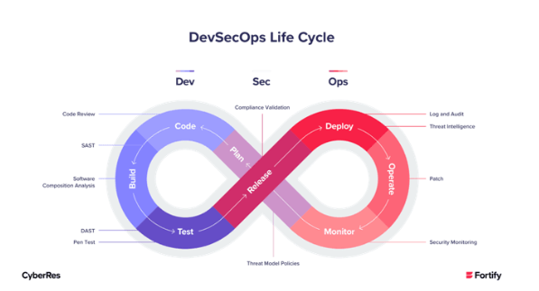

# Cyber Security - Application Security (AppSec)

This is a project to help people interested in Cyber Security - Application Security (AppSec).

The basis of the resources built here consists of creating a Stack that can be used to create an environment to perform tasks related to the subject.

## DevSecOps

DevSecOps represents a natural and necessary evolution in how development organizations approach security. DevSecOps seamlessly integrates application and infrastructure security into processes and tools. Additionally, DevSecOps makes application and infrastructure security a shared responsibility of development, security, and IT operations teams.

# How to Run

~~~shell
docker-composer up -d
~~~

## Sonarqube
> To access this service, you open this link [http://127.0.0.1:9000/](http://127.0.0.1:9000/)

This project has an administrative area that must be accessed through username and password.

- User: admin
- Password: admin

## DVWA
> To access this service, you open this link [http://127.0.0.1:80](http://127.0.0.1:80/)

## Juice Shop
> To access this service, you open this link [http://127.0.0.1:3000/](http://127.0.0.1:3000/)
